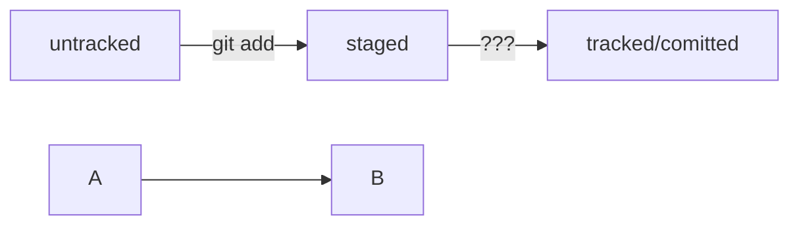

# Телеграмм Бот для студентов ТУИТ
## Расписание уроков
----
HEAD -- это голова.  
Коммит -- это всему голова.  
Статусы файлов:  


```bash
pip install aiogram==2.25.1
```
```python
from aiogram import Bot, Dispatcher, executor, types
from aiogram.dispatcher.filters import Text
```
